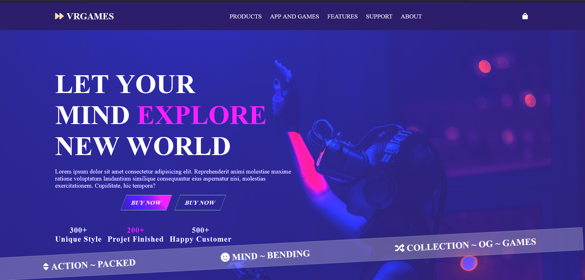
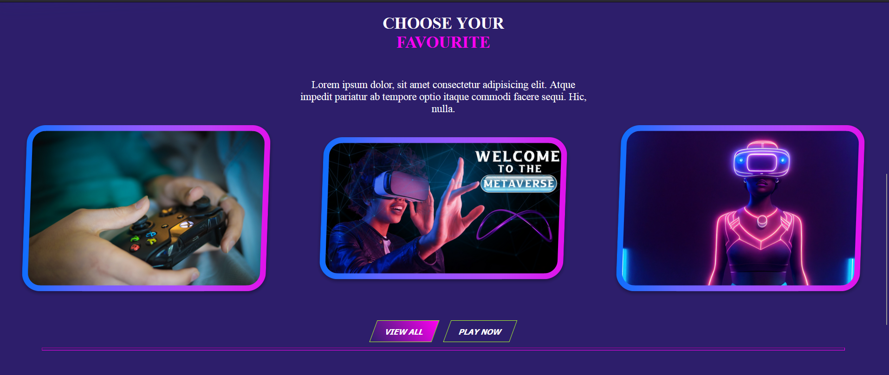
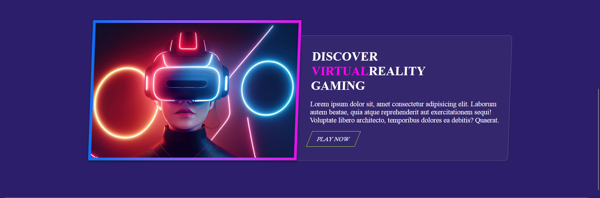

# VR Games Website Landing Page

In this frontend project, I have designed a VR Games website landing page using only HTML and CSS. The purpose of this project was to enhance my skills in HTML and CSS, particularly focusing on flexbox layout.

During the design process, I learned various techniques such as integrating Google Fonts, Font Awesome icons, utilizing flex properties for layout, applying rotate and skew transformations, creating gradients, and using negative margins effectively.

## Samples

### Sample 1

### Sample 2

### Sample 3

###Thank you !!

